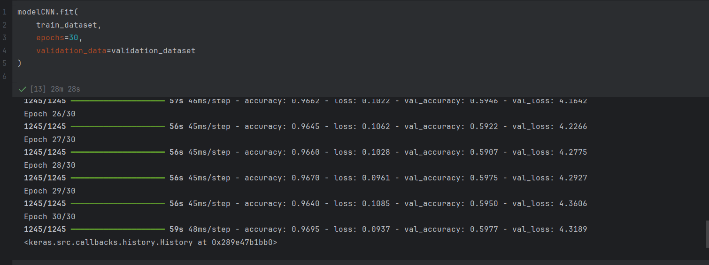

Rapport du Projet : Classification des Émotions avec un Réseau de Neurones Convolutif (CNN)
1. Introduction

L’objectif de ce projet est de construire un modèle capable de reconnaître différentes émotions humaines à partir d’images.
Pour cela, nous utilisons un réseau de neurones convolutif (CNN), un type de modèle particulièrement adapté à l’analyse d’images.

Le dataset contient des images de visages organisées en 7 émotions.
Le code permet de :

Préparer les données

Visualiser des images

Construire un modèle CNN

L’entraîner et le valider

L’évaluer

Tester les prédictions finales

2. Chargement du Dataset

Le dataset se trouve dans :

C:\Users\chhou\PycharmProjects\PythonProject3\emotions

Les images sont organisées par émotion (un dossier = une émotion).

Le chargement utilise image_dataset_from_directory() :

train_dataset = tf.keras.utils.image_dataset_from_directory(..., validation_split=0.2, subset="training")
validation_dataset = tf.keras.utils.image_dataset_from_directory(..., validation_split=0.2, subset="validation")
full_dataset = tf.keras.utils.image_dataset_from_directory(...)

80% → entraînement

20% → validation

15% des données reshufflées → test

Les images sont redimensionnées en 48×48 pixels, batch size = 32.

3. Visualisation des Données

Avant l’entraînement, un échantillon de 9 images est affiché :

Chaque image montre un visage

Avec l'émotion réelle en titre

plt.imshow(images[i].numpy().astype("uint8"))
plt.title(class_names[labels[i]])

Cela confirme que le chargement du dataset est correct.

4. Conception du Modèle CNN

Le modèle est composé de plusieurs blocs :

🔹 1. Normalisation
tf.keras.layers.Rescaling(1./255)

🔹 2. Convolutions + MaxPooling

Conv2D(32) : extraction de caractéristiques simples

Conv2D(64) : extraction intermédiaire

Conv2D(128) : extraction avancée

MaxPooling2D() entre chaque convolution

🔹 3. Couches Denses

Flatten()

Dense(128, relu)

Dense(7, softmax) : 7 classes d’émotions

Architecture simple et efficace pour des images 48×48.

5. Compilation et Entraînement

Le modèle est compilé avec :

Optimiseur : Adam

Loss : sparse_categorical_crossentropy

Metric : accuracy

Entraînement sur 30 epochs :

modelCNN.fit(train_dataset, epochs=30, validation_data=validation_dataset)

Suivi :

précision d’entraînement

précision de validation

6. Évaluation

Le modèle est évalué sur le dataset de test :

modelCNN.evaluate(test_dataset, verbose=2)

Ce test mesure les performances réelles du modèle sur des images jamais vues.

7. Prédictions Finales

Le modèle effectue des prédictions :

Probabilités générées par model.predict

Classe prédite = argmax

Affichage sous la forme :

Vrai: <classe réelle> — Prédit: <classe prédite>

Cela permet de détecter les erreurs ou confusions entre émotions.
